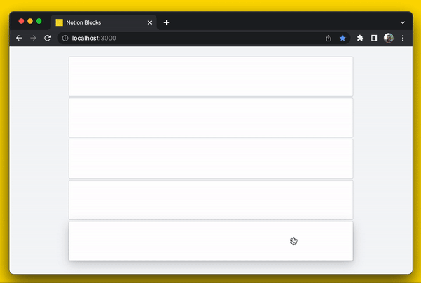

# Notion Blocks

One of the big reasons why I'm in love with [Notion](https://notion.so) is that it's interactions feel great. One interaction that I really like and that's core to the product is dragging. Dragging blocks, documents, or any other object is critical to the Notion feel. Getting that feel is hard but I'm going to try my best!

## Getting Started 

1. `git clone https://github.com/olagun/notion-blocks`
2. `cd covidtesting`
3. `npm i`
4. `npm start`

## Technologies Used

- **React.js** - AFAIK, Notion uses React.
- **Framer Motion** - I chose Framer Motion because _it's really good for declarative stateful animations_, but it also provides a really nice imperative API which is great for times when you don't want to force a re-render, but you want animate a value.

MIT License
